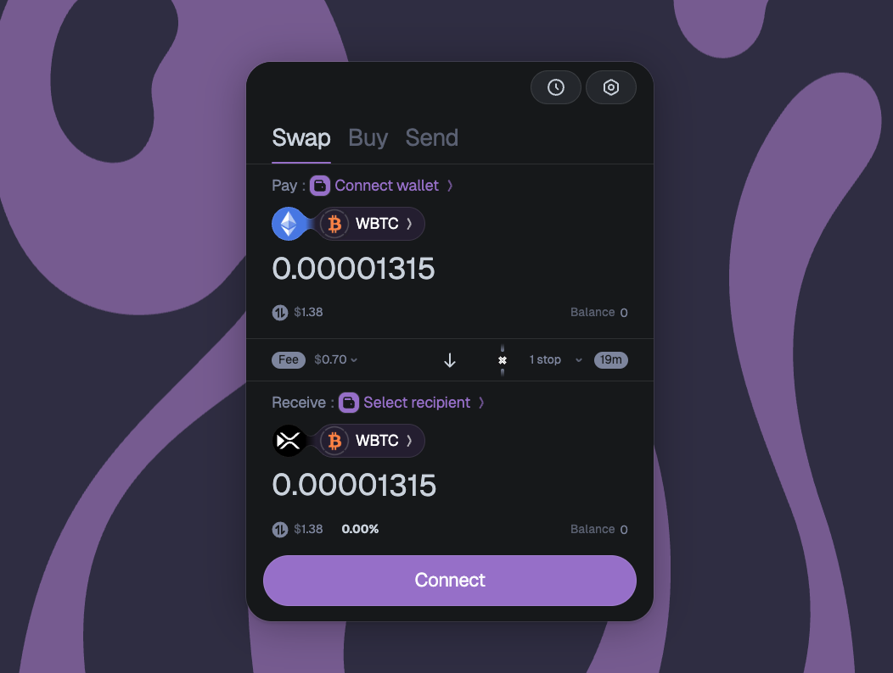
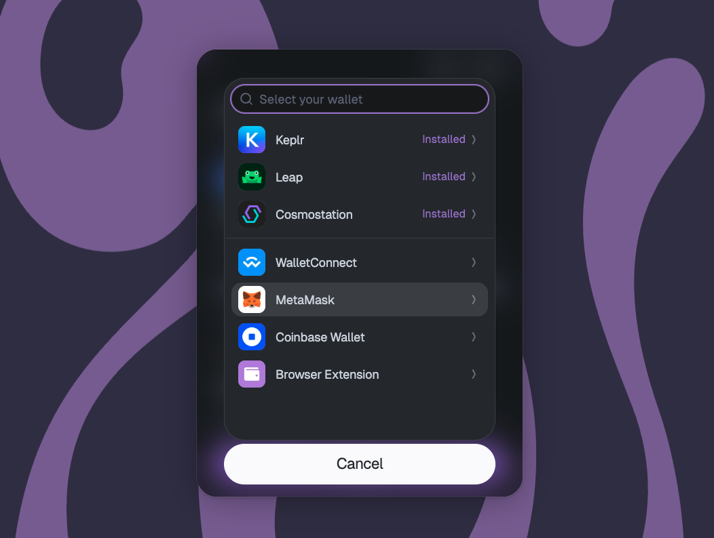
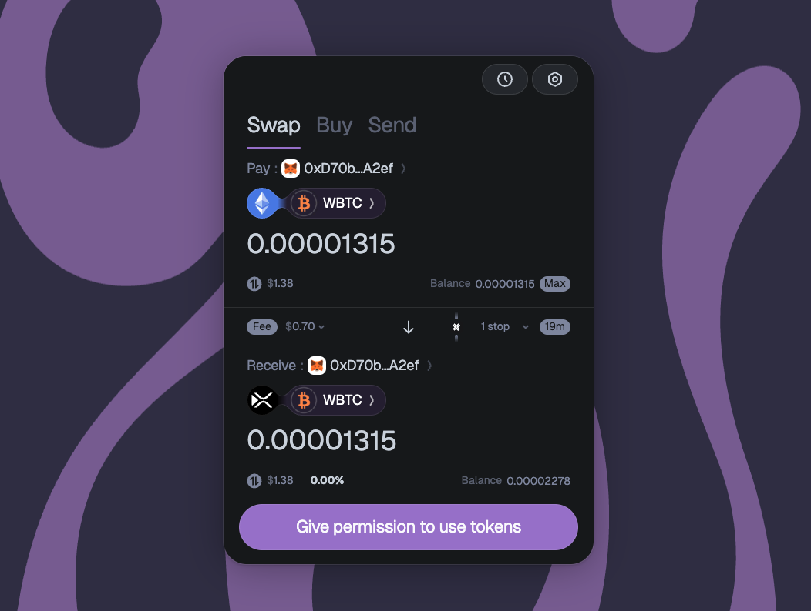
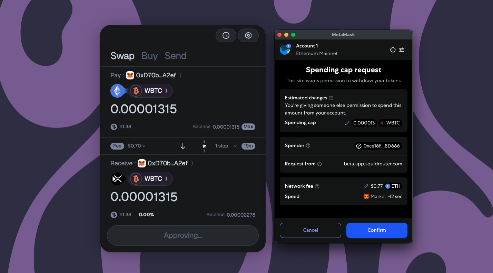
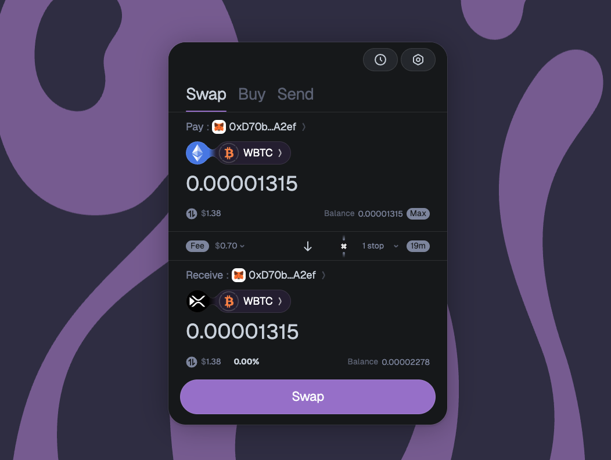
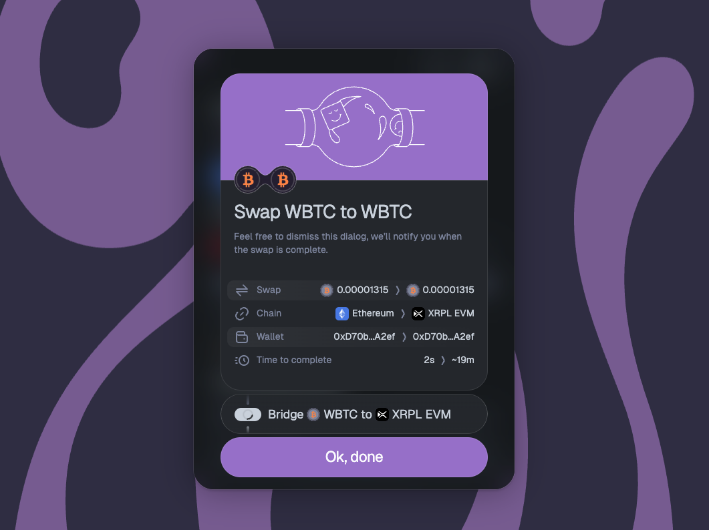
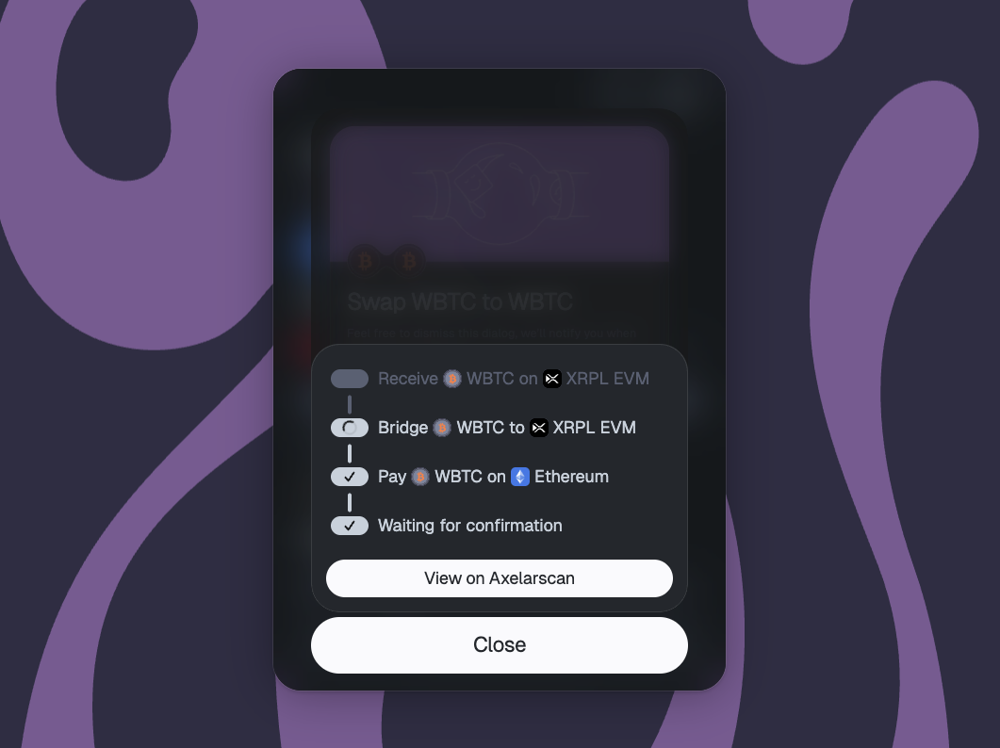

# Transfer ERC20 with Axelar

Any ERC20 token on a connected EVM chain can move to the XRPL EVM and back using [Squid Router](https://app.squidrouter.com/), which routes transfers through Axelar. In this example, we will transfer WBTC from Ethereum to the XRPL EVM.

1. **Set** Ethereum as the **source chain**, XRPL EVM as the **destination chain** and WBTC as the **asset** to transfer.
   

2. **Connect** your **wallet**.

   

3. **Set** the desired **amount**.

   

4. **Give permission** to use the tokens, sign the approve function.

   

5. Finally **SWAP** to execute the crosschain transfer.

   

Once the transaction is executed, you can see the transaction details in the following modal.

